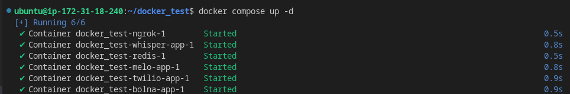
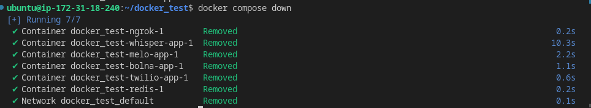

# Bolna With MeloTTS and WhisperASR
Introducing our Dockerized solution! Seamlessly merge [Bolna](https://github.com/bolna-ai/bolna) with [Whisper ASR](https://github.com/bolna-ai/streaming-whisper-server) and [Melo TTS](https://github.com/anshjoseph/MiloTTS-Server) for telephone provider we use Twillo and for tunning we use ngrok. This is docker compose by which you can host bolna server Whisper ASR, Melo TTS together in cloud just by clone this repo  and follow these simple steps to deploy ,but before that you have to make sure that you have [docker](https://docs.docker.com/engine/install/) and [docker compose](https://docs.docker.com/compose/install/) and make a .env file refer to .env-sample and also put ngrok auth token in ngrok-config.yml file


### Dockerfiles

- <a href="https://hub.docker.com/r/bolnadev/whisper_server">
    
  </a>
-  <a href="https://hub.docker.com/r/bolnadev/melo_server">
    
  </a>


### Start Services
```shell
# build latest `twilio-app` and `bolna-app`
docker compose build twilio-app bolna-app

# run containers
docker compose up -d
```
the output something like this


note: make sure that your all service were runing

### Creating Agent
for creating agent you have to execute following command mention below

<details>
<summary>Agent create API</summary><br>

```shell
curl --location 'http://0.0.0.0:5001/agent' \
--header 'Content-Type: application/json' \
--data '{
    "agent_config": {
        "agent_name": "Bolna Agent",
        "agent_welcome_message": "Hey how are you!",
        "tasks": [
            {
                "tools_config": {
                    "output": {
                        "format": "wav",
                        "provider": "twilio"
                    },
                    "input": {
                        "format": "wav",
                        "provider": "twilio"
                    },
                    "synthesizer": {
                        "provider": "melotts",
                        "provider_config": {
                        "voice": "Alex",
                        "sample_rate": 8000,
                        "sdp_ratio" : 0.2,
                        "noise_scale" : 0.6,
                        "noise_scale_w" :  0.8,
                        "speed" : 1.0
                        },
                        "stream": true,
                        "buffer_size": 123,
                        "audio_format": "pcm"
                    },
                    "llm_agent": {
                        "model": "deepinfra/meta-llama/Meta-Llama-3-70B-Instruct",
                        "max_tokens": 123,
                        "agent_flow_type": "streaming",
                        "use_fallback": true,
                        "family": "llama",
                        "temperature": 0.1,
                        "request_json": true,
                        "provider": "deepinfra"
                    },
                    "transcriber": {
                        "encoding": "linear16",
                        "language": "en",
                        "model": "whisper",
                        "stream": true,
                        "modeltype":"distil-large-v3",
                        "keywords":"ansh,joseph,hola",
                        "task": "transcribe",
                        "provider":"whisper"
                    },
                    "api_tools": null
                },
                "task_config": {
                    "ambient_noise_track": "office-ambience",
                    "hangup_after_LLMCall": false,
                    "hangup_after_silence": 10.0,
                    "ambient_noise": false,
                    "interruption_backoff_period": 0.0,
                    "backchanneling": false,
                    "backchanneling_start_delay": 5.0,
                    "optimize_latency": true,
                    "incremental_delay": 100.0,
                    "call_cancellation_prompt": null,
                    "number_of_words_for_interruption": 3.0,
                    "backchanneling_message_gap": 5.0,
                    "use_fillers": false
                },
                "task_type": "conversation",
                "toolchain": {
                    "execution": "parallel",
                    "pipelines": [
                        [
                            "transcriber",
                            "llm",
                            "synthesizer"
                        ]
                    ]
                }
            }
        ],
        "agent_type": "Lead Qualification"
    },
    "agent_prompts": {
        "task_1": {
            "system_prompt": "Ask if they are coming for party tonight"
        }
    }
}'

```
</details>

below given is the response 


Copy this `agent_id` we have to use in next step while invoking the call

<details>
<summary>Invoke call API</summary><br>

```shell
curl --location 'http://0.0.0.0:8001/call' \
--header 'Content-Type: application/json' \
--data '{
    "agent_id": "bf2a9e9c-6038-4104-85c4-b71a0d1478c9",
    "recipient_phone_number": "+1XXXXXXXXXX"
}'
```
</details>

You should hear your phone ringing now.

### Stop Services
```shell
docker compose down
```



### Changing the voice MeloTTS
<a id="change-voice"></a>
by default we resrtict Melo EN but there were 5 option for voice as mention below
- ['EN-US'](./audio/audio_sample/EN_US.wav) 
- ['EN-BR'](./audio/audio_sample/EN-BR.wav) 
- ['EN-AU'](./audio/audio_sample/EN-AU.wav) 
- ['EN-Default'](./audio/audio_sample/EN-Default.wav) 
- ['EN_INDIA'](./audio/audio_sample/EN_INDIA.wav)

you have to just change the following section mention below
```JSON
{
  "synthesizer": {
    "provider": "melo",
    "provider_config": {
      "voice": "<put your selected voice here>",
      "sample_rate": 8000,
      "sdp_ratio": 0.2,
      "noise_scale": 0.6,
      "noise_scale_w": 0.8,
      "speed": 1.0
    },
    "stream": true,
    "buffer_size": 123,
    "audio_format": "pcm"
  }
}
```


### Conservation DENO
This is demo using below prompt to the LLM
```json
"task_1": {
      "system_prompt": "You are assistant at Dr. Sharma clinic you have to book an appointment"
}
```


[chat GPT 3.5 turbo 16k demo](./audio/demo_audio.mp3)

you can give prompt as per your use case 